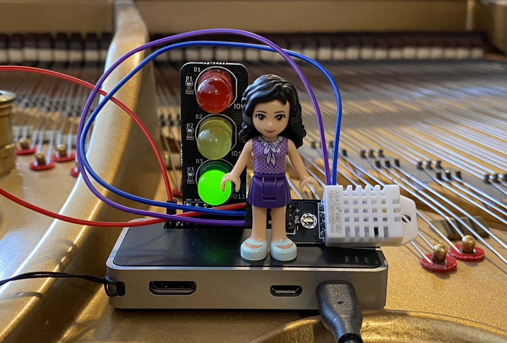

# In-piano Humidity Tracker

This is a Raspberry Pi device that 
  - Periodically measures temperature and humidity in a piano
  - Records the measured data in a cloud database (Kintone), and
  - Generates an alert voice message when humidity is low. 

  

## Hardware

- Raspberry Pi Zero
- Temp/humidity sensor (AM2302)
- Bluetooth speaker

## Software

